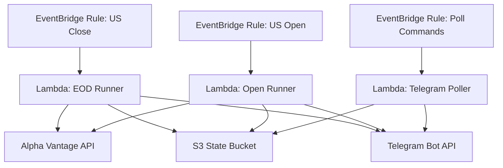

# swing-alert-bot — Technical Design (with **uv**)

> A lightweight Telegram bot that sends swing trading alerts for U.S. stocks using daily signals. Runs on AWS serverless (Lambda + EventBridge + S3) with minimal cost and operational overhead. Dependencies are managed and built with **uv** for fast, reproducible installs and lean Lambda artifacts.

---

## 1. Goals

* Automate swing trading signal detection for U.S. stocks.
* Deliver actionable Telegram alerts **twice daily**: market **close** and **open**.
* Manage held tickers with simple Telegram commands.
* Operate within AWS Free Tier.
* Infrastructure as code with Terraform.
* **Use uv** for fast, deterministic dependency management, builds, and CI.

---

## 2. Architecture



* **EOD Runner**: fetch data, compute signals, send buy/sell *candidates*.
* **Open Runner**: apply gap filter, send day-of entry guidance.
* **Telegram Poller**: process `/buy`, `/sell`, `/list`.
* **State**: encrypted JSON in S3 (held list, dedup keys, last update id).
* **Secrets**: SSM Parameter Store or Secrets Manager.

---

## 3. Tech Stack

* **Language**: Python **3.11**
* **Dependency & build tool**: **uv** (lockfile + blazing-fast resolver/installer)
* **Libraries**:

  * Data/TA: `pandas`, `pandas-ta` (EMA, RSI, ATR)
  * HTTP: `httpx`
  * Config/Models: `pydantic`
  * Crypto: `cryptography` (Fernet)
  * Testing: `pytest`, `pytest-cov`
* **AWS**: Lambda, EventBridge Scheduler, S3, SSM/Secrets Manager
* **IaC**: Terraform

---

## 4. Repository Layout

```
swing-alert-bot/
├─ src/
│  ├─ common/             # shared utils (AV client, Telegram, config, logging)
│  ├─ eod/handler.py      # Lambda: EOD Runner
│  ├─ open/handler.py     # Lambda: Open Runner
│  ├─ poller/handler.py   # Lambda: Telegram Command Poller
│  └─ state/              # state read/write, encryption, optimistic lock helpers
├─ infra/terraform/
│  ├─ main.tf             # Lambda, EventBridge, S3, IAM, SSM/Secrets
│  ├─ variables.tf
│  ├─ outputs.tf
│  └─ env/
│     ├─ dev.tfvars
│     └─ prod.tfvars
├─ tests/
│  ├─ unit/
│  └─ integ/
├─ .github/workflows/
│  ├─ ci.yml              # uv-based lint/typecheck/test
│  └─ deploy.yml          # Terraform plan/apply (dev/prod)
├─ pyproject.toml         # project metadata & deps (managed by uv)
├─ uv.lock                # uv lockfile (pin exact artifacts w/ hashes)
├─ README.md
├─ PRD.md
└─ TECHNICAL_DESIGN.md
```

> We prefer **`pyproject.toml` + `uv.lock`** over `requirements.txt` for reproducibility and speed. If needed, we can export a `requirements.txt` for tooling compatibility (`uv export`).

---

## 5. Dependency Management & Build with **uv**

### Local dev

```bash
# Install uv (one-time)
curl -LsSf https://astral.sh/uv/install.sh | sh
# or: pipx install uv

# Create venv & sync deps (from pyproject + uv.lock)
uv venv
uv sync  # installs prod + dev dependencies

# Run tests / tools
uv run pytest -q
uv run ruff check .
uv run mypy src
```

### Locking & updates

```bash
# Add/upgrade deps
uv add httpx
uv add -D pytest
uv lock --upgrade
```

### Lambda packaging (lean artifact)

Two common options:

**A) Single-zip function artifact**

```bash
# Create a clean build dir
rm -rf build && mkdir -p build
# Vendor prod deps into build/python (Lambda layer layout) or build/site-packages
uv pip install --no-deps -t build/python -r <(uv export --no-dev --format=requirements-txt)
# Add our src
rsync -a src/ build/src/
# Zip (per function or shared if using handler mapping)
cd build && zip -r ../lambda.zip .
```

**B) Lambda **Layer** for 3rd-party deps + small function zips**

```bash
rm -rf layer && mkdir -p layer/python
uv pip install --no-deps -t layer/python -r <(uv export --no-dev --format=requirements-txt)
cd layer && zip -r ../layer.zip .
# Then package function code (src only) as small zips.
```

> `uv export --no-dev --format=requirements-txt` yields a precise requirements file from the lock, ensuring packaged wheels match the lockfile. Prefer manylinux wheels to avoid native build steps.

---

## 6. Data Provider

* **Alpha Vantage** (free): **5 req/min**, **500 req/day**.
* Plan: \~**200 tickers × 2 runs/day = 400 calls/day** ⇒ within quota.
* Throttling: token-bucket or simple `sleep` to obey 5 RPM.
* Cache last fetched date per symbol; skip if unchanged.

---

## 7. Signal Logic

* **Indicators**: EMA(20, 50), SMA(200), RSI(14), ATR(14).
* **Long candidate** (Buy):

  * Close > SMA200 (trend)
  * EMA20 crosses **above** EMA50
  * RSI crosses **back above** 30
  * Risk guide: Stop = Close − 1.5×ATR; Target = Close + 3×ATR (≈1:2 R\:R)
* **Gap filter at open**:

  * If Open ≥ PrevClose + min(3%, 1×ATR): hold base entry; use intraday re-break or pullback rules.

---

## 8. Telegram UX

**Commands**

* `/buy TICKER` → mark as held
* `/sell TICKER` → unmark
* `/list` → show held tickers

**Alert (action-first)**

```
🟢 [BUY CANDIDATE] AAPL
Action today: Decide if you will enter at the next U.S. market open

Why:
- EMA20 crossed above EMA50 (uptrend)
- Price above 200SMA
- RSI(14) bounced above 30

Plan:
- Base: enter at next open
- Exception: gap > 3% or >1×ATR → wait for re-break or pullback

Risk guide:
- ATR(14): $3.10
- Stop: $145.5 / Target: $159.5 (≈1:2 R:R)
Validity: 3 trading days
```

---

## 9. State Persistence (S3)

* S3 object (encrypted JSON):

```json
{
  "held": ["AAPL","NVDA"],
  "alerts_sent": { "AAPL:2025-09-05:EMA_GC": true },
  "last_update_id": 1234567
}
```

* Encrypt at rest using Fernet (key in Secrets Manager).
* Concurrency: ETag conditional writes (optimistic locking) + retry.
* If contention grows, migrate to DynamoDB (conditional updates) later.

---

## 10. Security

* **IAM least privilege** per Lambda (only required S3/SSM/Secrets actions).
* **Secrets** (AV key, Telegram token/chat id, Fernet key) in **SSM/Secrets Manager**.
* **S3 bucket**: server-side encryption, minimal public access, block ACLs.
* **uv.lock** in repo for verified, reproducible installs (hash integrity).
* CI: no secrets in logs.

---

## 11. CI/CD (GitHub Actions with **uv**)

**`ci.yml`**

* `actions/setup-python@vX` (3.11)
* Install uv: `pipx install uv` (or curl installer)
* `uv sync` (cache `.uv/` and `.venv/` for speed)
* Lint/typecheck/test: `uv run ruff`, `uv run mypy`, `uv run pytest`
* On `main`, build artifacts (layer + function zips) as needed.

**`deploy.yml`**

* OIDC→AWS role (least privilege)
* Terraform `init/plan/apply` with `-var-file=infra/terraform/env/{dev|prod}.tfvars`
* Upload Lambda artifacts (or point to an artifact bucket)
* Optionally run post-deploy smoke Lambda invoke.

> Caching tip: cache `.uv/cache` (or default uv cache dir) between CI runs for very fast installs.

---

## 12. Performance & Cost

* **Performance**: \~200 tickers per run under 15-min Lambda timeout (with throttling).
* **Cost**: Lambda + EventBridge + S3 are effectively **\$0/month** at personal scale (within Free Tier).
* **uv benefit**: Very fast dependency resolution and install in CI; smaller, deterministic artifacts.

---

## 13. Scalability

* Shard tickers across multiple Lambdas (e.g., A–L, M–Z) using multiple EventBridge schedules.
* Switch to a higher-throughput provider (Finnhub/Polygon) if needed.
* Migrate state to DynamoDB for higher write concurrency and atomic updates.
* Add `uv export` to generate compatibility requirements files for other tooling if necessary.

---

## 14. Risks & Mitigations

| Risk                      | Impact               | Mitigation                                           |
| ------------------------- | -------------------- | ---------------------------------------------------- |
| Alpha Vantage rate limits | Delayed/partial runs | Throttle, shard, reduce N, upgrade plan              |
| S3 concurrency            | Lost updates         | ETag conditional write, retry, DynamoDB later        |
| DST shifts                | Timing errors        | EventBridge + runtime guard on US/Eastern            |
| Secrets leakage           | Security incident    | Only in SSM/Secrets, redact logs                     |
| Native deps build         | Larger zips          | Prefer manylinux wheels via `uv export`; layer split |

---

## 15. Roadmap (Infra + Tooling)

* **v1**: Lambda + EventBridge + S3 + Terraform, **uv**-managed deps; manual watchlist; Telegram alerts.
* **v1.1**: Auto screener (top N by 20-day dollar volume & trend); always include held; consider DynamoDB.
* **v1.2**: Chart image snapshots in alerts.
* **v2**: Korean market integration.

---

### Quickstart (Developer Cheatsheet)

```bash
# Setup
curl -LsSf https://astral.sh/uv/install.sh | sh
uv venv && uv sync

# Run tests, type/lint
uv run pytest
uv run ruff check .
uv run mypy src

# Build export for Lambda packaging
uv export --no-dev --format=requirements-txt > .cache/req.txt
uv pip install --no-deps -t build/python -r .cache/req.txt
rsync -a src/ build/src/
cd build && zip -r ../lambda.zip .
```

---

## 16. Environments & State (Local by default)

This project uses two environments (dev, prod) with the same Terraform code. For a solo developer on a single machine, keep Terraform state **local** and use workspaces to separate environments. A remote backend can be added later if CI or multiple machines are introduced.

- Workspaces:
  - Use `default` as the dev workspace, and create a `prod` workspace: `terraform workspace new prod`.
  - Select workspace before running a plan/apply: `terraform workspace select prod`.

- Optional: Remote State backend (for CI/multi-machine):
  - S3 bucket: `sab-tfstate-<ACCOUNT_ID>` (versioning on, encryption on)
  - DynamoDB table: `sab-tf-locks` (PK: `LockID`)
  - Backend key: `env/${terraform.workspace}/terraform.tfstate`

- Optional: Bootstrap via CLI (one-time):
  - Create bucket (us-east-1): `aws s3api create-bucket --bucket sab-tfstate-<ACCOUNT_ID> --region us-east-1`
  - Enable versioning: `aws s3api put-bucket-versioning --bucket sab-tfstate-<ACCOUNT_ID> --versioning-configuration Status=Enabled`
  - Enable default encryption: `aws s3api put-bucket-encryption --bucket sab-tfstate-<ACCOUNT_ID> --server-side-encryption-configuration '{"Rules":[{"ApplyServerSideEncryptionByDefault":{"SSEAlgorithm":"AES256"}}]}'`
  - Create DynamoDB lock table: `aws dynamodb create-table --table-name sab-tf-locks --attribute-definitions AttributeName=LockID,AttributeType=S --key-schema AttributeName=LockID,KeyType=HASH --billing-mode PAY_PER_REQUEST --region us-east-1`

- Optional: Backend configuration snippet (add to `infra/terraform/backend.tf`):
```
terraform {
  backend "s3" {
    bucket         = "sab-tfstate-<ACCOUNT_ID>"
    key            = "env/${terraform.workspace}/terraform.tfstate"
    region         = "us-east-1"
    dynamodb_table = "sab-tf-locks"
    encrypt        = true
  }
}
```

- Optional: Migrate existing local state:
  - `terraform init -reconfigure -migrate-state`
  - Verify S3 now contains `env/default/terraform.tfstate` (and `env/prod/...` after prod apply)

- Optional: Minimal IAM for backend access (attach to deploy identity):
```
{
  "Version": "2012-10-17",
  "Statement": [
    {
      "Effect": "Allow",
      "Action": ["s3:ListBucket"],
      "Resource": "arn:aws:s3:::sab-tfstate-<ACCOUNT_ID>",
      "Condition": {"StringLike": {"s3:prefix": ["env/*/terraform.tfstate"]}}
    },
    {
      "Effect": "Allow",
      "Action": ["s3:GetObject","s3:PutObject","s3:DeleteObject"],
      "Resource": "arn:aws:s3:::sab-tfstate-<ACCOUNT_ID>/env/*/terraform.tfstate"
    },
    {
      "Effect": "Allow",
      "Action": ["dynamodb:DescribeTable","dynamodb:GetItem","dynamodb:PutItem","dynamodb:DeleteItem"],
      "Resource": "arn:aws:dynamodb:us-east-1:<ACCOUNT_ID>:table/sab-tf-locks"
    }
  ]
}
```

Notes:
- Keep the app’s S3 “state bucket” (encrypted JSON) separate from any Terraform backend bucket.
- Local state tips: do not commit `*.tfstate`; back up `infra/terraform/terraform.tfstate.d/` occasionally.
- For production safeguards, consider `prevent_destroy` on critical resources and use KMS (`aws:kms`) if compliance requires.

---

## 17. Chat Whitelist (Telegram)

Purpose: restrict bot interactions to approved Telegram chat IDs. This protects a single-user bot from unsolicited messages and prevents accidental outbound sends to the wrong chat.

- Config source: AWS SSM Parameter Store at `${PARAM_PREFIX}allowed_chat_ids`.
  - `PARAM_PREFIX` is provided via Lambda env, typically `/${project_name}/${environment}/` (e.g., `/swing-alert-bot/dev/`).
  - Value format: either CSV (e.g., `"12345,67890"`) or JSON array string (e.g., `"[\"12345\",\"67890\"]"`).
  - Stored as SecureString for convenience (not secret), managed by Terraform’s `secrets` module when provided, or set out-of-band.

- Loading & caching:
  - Read on cold start; cache in-process between invocations. Optional TTL refresh (e.g., 5–15 minutes) to pick up changes without redeploy.
  - If the parameter is missing/empty → whitelist enforcement is disabled (no-op). This matches the MVP’s single-user setup for fast bring-up.
  - If parsing fails (malformed CSV/JSON) → fail closed for inbound commands (ignore) and outbound sends (drop) and log a warning.

- Inbound enforcement (Telegram Poller):
  - For each update, check `message.chat.id` against the whitelist.
  - If not whitelisted: do not reply, but advance the update offset to avoid reprocessing spam; log at debug level.
  - If whitelisted: process `/buy`, `/sell`, `/list` normally.

- Outbound enforcement (EOD/Open Runners):
  - When sending alerts, validate the target `telegram_chat_id` is whitelisted.
  - If whitelist is unset → no-op (send as usual).
  - If set and target is not whitelisted → drop the send and log a warning to avoid accidental broadcasts.

- Terraform integration:
  - `infra/terraform/README.md` defines `allowed_chat_ids` as an optional secret and always grants Lambdas read access to `${PARAM_PREFIX}allowed_chat_ids`.
  - You can supply the value via `envs/<env>.tfvars` or manage the parameter out-of-band.

- Operations (update whitelist):
  - CSV example:
    - `aws ssm put-parameter --name "/${PROJECT}/${ENV}/allowed_chat_ids" --type SecureString --value "12345,67890" --overwrite`
  - JSON array example:
    - `aws ssm put-parameter --name "/${PROJECT}/${ENV}/allowed_chat_ids" --type SecureString --value '["12345","67890"]' --overwrite`
  - Verify:
    - `aws ssm get-parameter --name "/${PROJECT}/${ENV}/allowed_chat_ids" --with-decryption --query Parameter.Value --output text`

- Testing (unit): ensure
  - Non-whitelisted inbound updates are ignored and offsets advance.
  - Outbound sends are blocked when target chat is not in the whitelist.
  - Unset whitelist behaves as no-op; malformed values fail closed with warnings.
